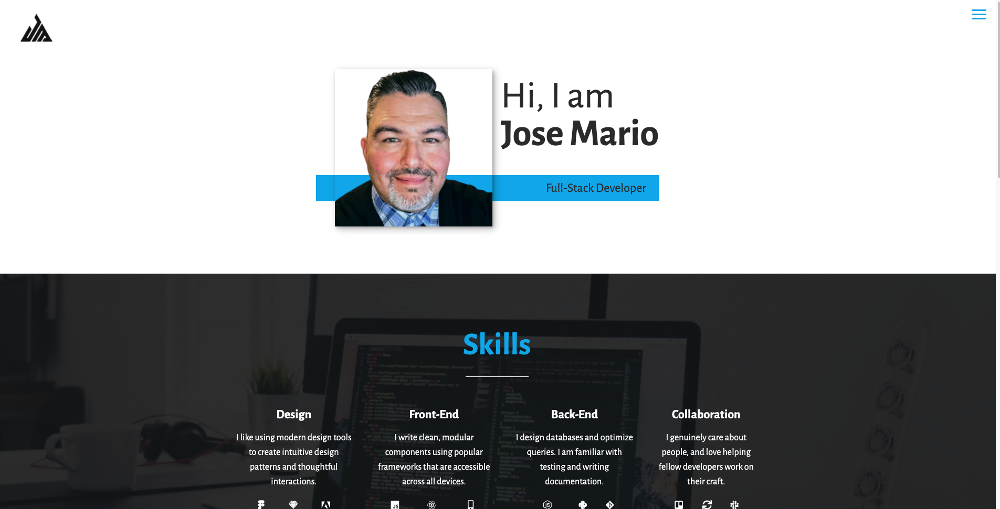
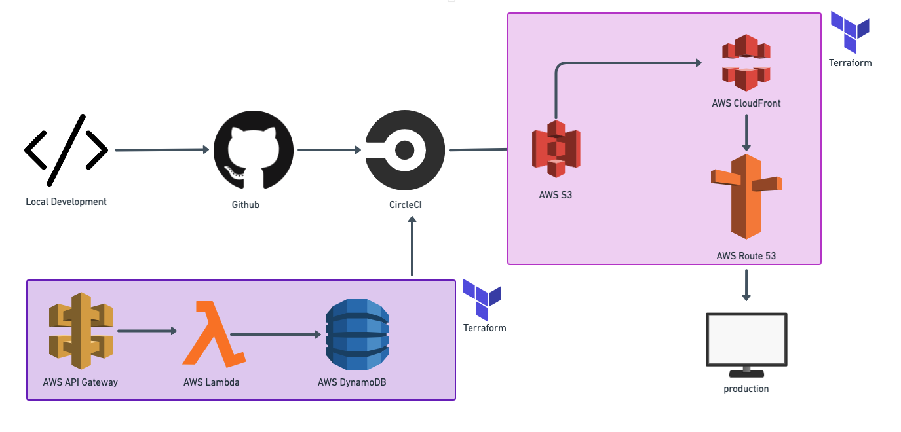

## JoseMario.me

_Learn about me and how I work_

This portfolio was built as part of the [Cloud Resume Challenge](https://www.cloudresumechallenge.dev) created by Forrest Brazeal of _A Cloud Guru_  
The challenge is a 16 step process of building a modern resume or portfolio using modern frameworks, automation, and serverless cloud technologies.

#

### Features

- Built front-end views using React and Sass with fully responsive design
- CI/CD using CircleCI
- Built AWS resources using Terraform:
  - Deployed app to S3 bucket and distribute content using CloudFront
  - custom domain using route 53
  - Backend logic was built using API Gateway, Lambda, and DynamoDb

#

### Architecture

#

### Build process

- Github was used for version control
- Multiple branches were created for features and staging
- CircleCI was used to create pipelines for CI/CD
- The AWS resources were created using Terraform for Infrastructure-as-Code

#

### The finished product

Visit my portfolio site and see it for yourself :globe_with_meridians:&nbsp;&nbsp;[www.josemario.me](https://www.josemario.me)
